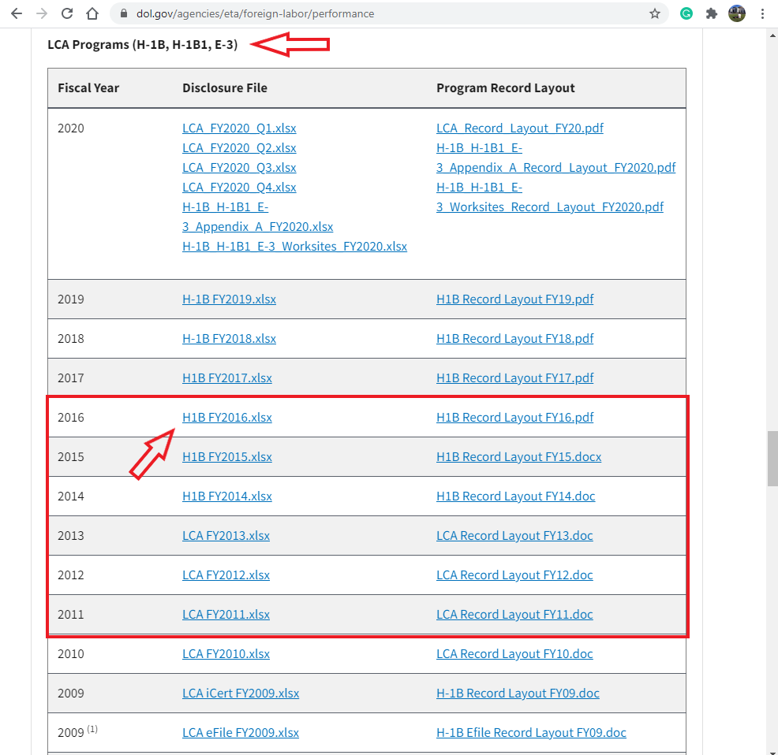

```{r setup, include=FALSE}
knitr::opts_chunk$set(echo = TRUE)
```

<a href=#"stage-one">Stage One</a>
<ul>
<li> <a href="#purpose">Purpose of the project</a> </li>
<li> <a href="#data">Data</a> </li>
<li> <a href="#structure-of-the-data">Structure of the data</a> </li>
<li> <a href="#obtaining-the-data">Obtaining the data</a> </li>
<li> <a href="#appendix">Appendix</a> </li>
</ul>

<div id="stage-one" class=section level2">

<h2> Stage One </h2>
<div id="purpose" class="section level3">
<h3>Purpose</h3>
<p> 1. <strong>What do you plan to do?</strong> - For this project, I will perform a comprehensive analysis of H-1B visa job market using a massive dataset from the Office of Foreign Labor Certification (OFLC). In this analysis, I will be looking specifically for H1B employees in the United States, and as a result will conclude on which part of the United States offers the most jobs for H-1B qualified specialists, and whether there was an increase or decrease of such job offering through 2015-2016. </p> 

<p> 2. <strong>What do you hope to understand or describe?</strong> - For the presentation part, I am planning on making either an interactive Shiny application in which I would implement a leaflet map and a few features that would change data presented on the map, or a statistical report in which I would make a thorough statistical analysis and confirmed hypothesis of the H-1B visa job market using several statistical reasonings. </p>

<p> 3. <strong>Why are you interested in this topic?</strong> - I am interested in this project because I am an international student myself, and as someone who would be seeking employment opportunities in Computer and Data Science industry, it would be interesting to know the data and understand what are the trends and what to expect. I hope that this analysis will be helpful to other students. I also believe that the majority of information presented at the end of the project will be suitable for any other people interested in the description of the job market, regardless of work authorization status, because the trends are often common and general across all people.</p>
</div> 

<div id="data" class="section level3">

<h3>Data</h3>
<p> 1. <strong>What is the data?</strong> This data is a collection of H-1B work visa petition data, with approximately 3 million records overall in the period from 2011 to 2016. The columns in the initial dataset include case status, employer name, worksite location, worksite coordinates, job titles, prevailing wage, occupation code, and year filled.</p>
<p> 2. <strong>How was it collected?</strong> The Office of Foreign Labor Certification (OFLC) generates disclosure data about the immigration programs including the H1-B visa, but the raw dataset was then transformed into a more suitable for analysis form by Sharan Naribole. I will include an example of the modified Kaggle data later in this document, but for now, please see an illustration on where to find a raw dataset for your convenience. </p>
<p> 3. <strong>Who collected it?</strong> The raw dataset was provided by the Office of Foreign Labor Certification (OFLC), which can be found online <a href="https://www.dol.gov/agencies/eta/foreign-labor/performance">here</a> </p>
<p> 4. <strong>Any other details necessary to properly understand the data for the purposes of your project?</strong> For the background information, the H-1B visa is a non-immigrant visa category for temporary foreign workers in the United States that is dependent on jobs. A US employer must offer a position and file an H-1B visa petition with the US immigration department in order for a foreign national to apply for the visa. After completing college/ higher education (Masters, PhD) and working full-time, this is the most common visa status applied for and retained by international students. <p>Also, later in this project I will be analyzing employers that offer the most H-1B qualified jobs from EMPLOYER_NAME columns. It is important to note that not all of the employers(companies) were based in the United States. Many of them have headquarters around the world, but all of them have an office/subsidiary/branch of their company in the US.  </p> </p> 

<div id="structure-of-the-data" class="section level3">

<h3>Structure of the data</h3>
<p> 1. <strong>What are the variables called?</strong> There are 10 columns in the dataset: case_status, employer_name, soc_name, job_title, full_time_position, prevailing_wage, year, worksite, lon(longutude of workcite), lat(latitute of workcite) </p>
<p> 2. <strong>What do they mean?</strong>
<p><strong>X1:</strong> which is the just the count of the rows;</p> 
<P><strong>CASE_STATUS:</strong> Status associated with the last significant event or decision, Valid values include “Certified,” “Certified-Withdrawn,” Denied,” and “Withdrawn”;</P>
<p><strong>EMPLOYER_NAME:</strong> Name of employer submitting the H1-B application, used in comparing salaries and number of applications of various employers;</P>
<p><strong>JOB_TITLE:</strong> Title of the job using which we can filter specific job positions for e.g., Data Scientist, Data Engineer etc;</P>
<p><strong>SOC_NAME:</strong> The occupation code for the employment;</P>
<p><strong>FULL_TIME_POSITION:</strong> Whether the application is for a full-time position of for a part-time position;</p>
<p><strong>PREVAILING_WAGE:</strong> The prevailing wage for a job position is defined as the average wage paid to similarly employed workers in the requested occupation in the area of intended employment; 
<P><strong>YEAR:</strong> The application year;</P>
<p><strong>WORKSITE_CITY/WORKSITE_STATE:</strong> The foreign worker’s intended area of employment;</p>
<p><strong>lon:</strong> Longitude of the employer worksite;</p>
<p><strong>lat:</strong> Latitude of the employer worksite</p>
</p>


<div style="overflow-x: scroll;">

```{r, echo=F, message=FALSE, warning=FALSE}
library(knitr)
library(kableExtra)
library(dplyr)
df <- read.csv("h1b.csv")
head(df,10) %>%
 kable( "html", escape=F, align="c") %>%
 kable_styling(bootstrap_options = "striped", full_width = F, position = "center", fixed_thead = T)
```
</div>
<p> 3. <strong>What are the types of the variables?</strong> For most of the columns, including CASE_STATUS, EMPLOYER_NAME, JOB_TITLE, SOC_NAME, FULL_TIME_POSITION, WORKSITE_CITY/STATE, variables are in a form of characters or strings, but columns such as PREVAILING_WAGE, lon, and lat are numeric, with YEAR being integer.</p>

<div style="overflow-x: scroll;">

```{r,echo=F, message=FALSE, warning=FALSE}
summary(df) %>%
 kable( "html", escape=F, align="c") %>%
 kable_styling(bootstrap_options = "striped", full_width = F, position = "center", fixed_thead = T)
```
</div>

<p> 4. <strong>Are any NA's present?</strong> Yes, there are occasional NAs present in some rows for some columns, but they can be excluded. More information about NAs will be covered in Stage 2.</p>
<p> 5. <strong>Are there any coding issues?</strong> There are no coding issues– all categorical levels correspond to what one would expect from their value.</p>
<p> 6. <strong>How much data is there?</strong> Initial dataframe from Kaggle has 11 columns and 3002458 observations. I am planning on trimming it, however, and keeping only 2015 and 2016 years, which would keep it within 1 million observations.</p>

<div id="obtaining-the-data" class="section level3">
<h3>Obtaining the data</h3>
<p> 1. <strong>Where did you get the data? </strong> I have downloaded this dataset from Kaggle.com. An author of the dataset, Sharan Naribole, did some data wrangling to bring it to an appropriate for analysis form, because the original raw data was not that suitable. Please see an image below for an illustration on how to navigate on Kaggle. The source of the dataset can be found <a href="https://www.kaggle.com/nsharan/h-1b-visa">here</a>.  </p>
<p> 2. <strong>Show how the data was imported into R</strong> The dataset was first downloaded from Kaggle. I then created a new folder in RStudio home directory, set a work directory to there, and used an "upload" button build in RStudio to transfer the dataset from my machine into local environment. To import the dataset, I used read.csv function built in R, such as df <- read.csv("h1b.csv"). </p>
<p> 3. <strong>What steps were necessary to get the data into the appropriate form? </strong>  For us to use any dataset, it is recommended to covert it to dataframe first. It can be done assigning our dataset to a variable of any name, which in my case was df <- read.csv("h1b.csv") </p>
<p> 4. <strong>What possible pitfalls exist?</strong> A major pitfall that the dataset is extremely large and RStudio gets overwhelmed when proceeding that much data. Another pitfall was that the author joined states and cities together in one column, which leaflet doesn't always accept. Because of this, I can to perform several manipulations in excel to create new columns and a few new datasets which included independent state names. Also, there are NAs present in several columns, mostly in lon and lat columns. I will trim the dataset later, but other than that I don't see any pitfalls. </p>
<p> 5. <strong>What data was initially trimmed (more may be removed later)?</strong> An author mentions that several data wrangling techniques were performed, such as merging or separating columns. I went ahead I checked the original, raw dataset from U.S Department of Labor (perfomance data section) and compared the dataset from Kaggle and from raw data. I found out that many columns were trimmed, so yes, Kaggle dataset was trimmed. Original raw data can be found <a href="https://www.dol.gov/agencies/eta/foreign-labor/performance">here</a> <strong>under LCA Programs (H-1B, H-1B1, E-3) section.</strong> I could have trimmed case_status column because most of the applicants are CERTIFIED, and this column doesn't have any practical usage for my work; however, I would love to make an extra analysis based on this column as well in future steps. In addition, I may be removing years from 2011 to 2014 because this information might not be relevant or actual to this day, and also to keep a dataset shorter (in this case, it is only about 1 million observations). I will keep the most relevant years available from the dataset (2015-2016).</p>
<p> 6. <strong>Any transformations? If so what (show details) and why.</strong> I am not planning on making any major transformations on a dataset from Kaggle. The author did some transformations, a few of which were removing CASE_SUBMITTED, VISA_CLASS, EMPLOYMENT_START_DATE, EMPLOYMENT_END_DATE, EMPLOYER_ADDRESS, EMPLOYER_POSTAL_CODE, EMPLOYER_COUNTRY, EMPLOYER_PROVINCE, EMPLOYER_PHONE, EMPLOYER_PHONE_EXT, AGENT_ATTORNEY_NAME, AGENT_ATTORNEY_CITY, SOC_CODE, NAID_CODE, TOTAL_WORKERS, PW_WAGE_SOURCE, PW_SOURCE_YEAR, PW_SOURCE_OTHER,WAGE_RATE_OF_PAY_FROM, WAGE_RATE_OF_PAY_TO, WAGE_UNIT_OF_PAY, H-1B_DEPENDENT, WILLFUL_VIOLATOR, WORKSITE_POSTAL_CODE, and ORIGINAL_CERT_DATE columns, and kept only essential to our analysis information. <p>In addition, the author mentioned that for WAGE column in the data set, there were two salary measurments - <strong> hourly based, and annually based.</strong> In summary, 92% of records provided WAGE at the Year scale, where only 7.73% provided the information at Hourly scale, and there were also 0.02% of mission information. The author removed missing information and converted hourly scale to year scale.</p> <p>Furthermore, the author added two completely new columns to the dataset - lat (latitude) and lon (longitude) columns. Since they were not provided in the raw dataset from Office of Foreign Labor Certification (OFLC). To do that, the author used ggmap package. Geocodes have been found for 96.47% of the records in our dataset inspite of not finding the geocodes for every unique Worksite value. </p>   <p>Lastly, the author merged Worksite City and Worsite States from the raw dataset into one column.</p></p>
<p> 7. <strong>Anything else necessary to properly understand the import process.</strong> An import process is straightforward. One warning I would give is that Kaggle requires an account in order to interact with their website, including when trying to download a dataset, so one might want to consider making an account there. If this is an issue, please let me know at abbas070@umn.edu and I will be happy to provide the same dataset. I will also attach it on Canvas as an additional document.</p>
</div>
</div>
</div>
</div>


<div id="appendix" class="section level3">
<h3>Appendix</h3>
<p><strong>Additional dataset structure variation</strong></p></div>
```{r}
glimpse(df)
```
<p><strong>H-1B General Information</strong></p>
<p>"The H-1B program allows companies and other employers in the United States to temporarily employ foreign workers in occupations that require the theoretical and practical application of a body of highly specialized knowledge and a bachelor’s degree or higher in the specific specialty, or its equivalent. H-1B specialty occupations may include fields such as architecture, engineering, mathematics, physical sciences, social sciences, medicine and health, education, business specialties, accounting, law, theology, and the arts." - <a href="https://www.uscis.gov/working-in-the-united-states/temporary-workers/h-1b-specialty-occupations-and-fashion-models/h-1b-cap-season">USCIS</a></p>


